# Session Continuity System
*Systematic AI collaboration intelligence with built-in adoption mechanisms*

## 🔄 System Flow Diagram

```mermaid
graph TD
    A["🚀 Session Start"] --> B{"📄 SESSION-PLAN.md<br/>Exists?"}
    
    B -->|No| C["📝 Create New Plan<br/>AI Interview Process<br/>Document Goals & Approach"]
    B -->|Yes| D["📋 Load Existing Plan<br/>Check Previous Status<br/>Update Session Goals"]
    
    C --> E["📋 Check Context<br/>CURRENT-STATE-SNAPSHOT.md<br/>PROBLEM-SOLVING-PATTERNS.md<br/>WORKING-RELATIONSHIP-DNA.md"]
    D --> E
    
    E --> F["💻 Active Collaboration<br/>Monitor Progress & Deviations"]
    
    F --> G{"🎯 Trigger Events"}
    
    G --> H["📈 Major Milestone"] 
    G --> I["🔄 Approach Deviation"]
    G --> J["💡 New Pattern Discovery"]
    G --> K["🌟 Blog-Worthy Insight"]
    G --> L["🧩 Problem-Solving Win"]
    G --> M["✅ Task Completion"]
    
    H --> N["📝 Update<br/>CURRENT-STATE-SNAPSHOT.md"]
    I --> O["📝 Update<br/>SESSION-PLAN.md (Deviations)<br/>+ DEVIATION-TRACKING-PROTOCOL.md"]
    J --> P["📝 Update<br/>WORKING-RELATIONSHIP-DNA.md"]
    K --> Q["📝 Update<br/>BLOG-LEARNING-MOMENTS.md"]
    L --> R["📝 Update<br/>PROBLEM-SOLVING-PATTERNS.md"]
    M --> S["📝 Auto-Check<br/>SESSION-PLAN.md Checkboxes"]
    
    N --> T["🔄 Continue Session"]
    O --> T
    P --> T
    Q --> T
    R --> T
    S --> T
    
    T --> G
    
    F --> U["🏁 Session End"]
    U --> V["📋 Final Updates<br/>Archive SESSION-PLAN.md<br/>Update CURRENT-STATE-SNAPSHOT.md<br/>Propose Document Updates"]
    
    V --> W["✅ Session Complete<br/>Intelligence Preserved<br/>Plan Ready for Next Session"]
    
    classDef startEnd fill:#ffffff,stroke:#0d47a1,stroke-width:3px,color:#000000
    classDef process fill:#f8f9fa,stroke:#4a148c,stroke-width:3px,color:#000000
    classDef trigger fill:#fff8e1,stroke:#e65100,stroke-width:3px,color:#000000
    classDef update fill:#f1f8e9,stroke:#1b5e20,stroke-width:3px,color:#000000
    
    class A,W startEnd
    class B,C,D,E,F,U,V process
    class G,H,I,J,K,L,M trigger
    class N,O,P,Q,R,S,T update
```



## The Problem We're Solving
**Good systems, poor adoption** - Having excellent documentation that gets forgotten or overlooked because it relies on manual memory rather than systematic triggers.

## The Solution Framework
**Layered Automation Approach** - Make good practices automatic, not optional.

---

## 📋 **Plan-Driven Session Management**

### **The Three Plan States**

**State 1: Brand New Project (No Plan Exists)**
```
SESSION START → Check for SESSION-PLAN.md
            → Not found? Create initial plan via AI interview
            → "What are we trying to accomplish?"
            → Document initial goals/approach with checkboxes
```

**State 2: Existing Project (Plan Exists)**
```
SESSION START → Load SESSION-PLAN.md
            → Check previous session status  
            → Update with new session goals
            → Continue from where we left off
```

**State 3: Cursor Tools Deployment (Template System)**
```
NEW PROJECT → Deploy cursor tools
           → Copy SESSION-PLAN-TEMPLATE.md
           → Initialize with project-specific goals
           → Systematic setup interview
```

### **SESSION-PLAN.md Structure**
```markdown
# Session Plan - [Date]
## Goals:
- [ ] Create cursor rules integration
- [ ] Test session continuity triggers  
- [ ] Update documentation

## Approach:
**Method**: Layered automation approach
**Timeline**: 2-3 hours
**Key Decisions**: Start with cursor rules, then test

## Progress Tracking:
- ✅ Completed items (auto-checked by AI)
- 🔄 In progress items
- ⏸️ Deferred items

## Deviations:
*(Added automatically when approach changes)*
- **Original**: Use simple triggers
- **Deviation**: Added plan-driven system for better structure
- **Reason**: User identified need for baseline to detect deviations
```

### **Auto-Checkbox System**
```
COMPLETION TRIGGERS:
- "That's complete" → Check off related item
- "We've finished X" → Check off X  
- "Done with Y" → Check off Y
- AI recognizes completion and updates plan
```

### **Deviation Detection & Cascade Updates**
```
DEVIATION PHRASES:
- "Actually, let's..." → DEVIATION DETECTED
- "Change of plan..." → DEVIATION DETECTED  
- "Better approach..." → DEVIATION DETECTED

AUTOMATIC CASCADE:
DEVIATION → Update SESSION-PLAN.md (add to deviations section)
         → Update DEVIATION-TRACKING-PROTOCOL.md (detailed analysis)
         → Update CURRENT-STATE-SNAPSHOT.md (if major change)
```

### **Plan Template System**
```
session-continuity/
├── SESSION-PLAN-TEMPLATE.md     # For new project deployment
├── SESSION-PLAN.md              # Current active project plan
└── SESSION-PLAN-ARCHIVE/        # Historical session records
    ├── 2025-01-XX-session.md
    └── 2025-01-YY-session.md
```

---

## 🔄 **Systematic Usage Process**

### **Session Start Protocol**
```
1. AI automatically checks CURRENT-STATE-SNAPSHOT.md for project context
2. Review any relevant patterns from PROBLEM-SOLVING-PATTERNS.md
3. Apply collaboration preferences from WORKING-RELATIONSHIP-DNA.md
```

### **Mid-Session Triggers**
```
WHEN: Major milestone achieved → UPDATE: CURRENT-STATE-SNAPSHOT.md
WHEN: Approach deviation occurs → UPDATE: DEVIATION-TRACKING-PROTOCOL.md  
WHEN: New collaboration pattern discovered → UPDATE: WORKING-RELATIONSHIP-DNA.md
WHEN: Blog-worthy insight emerges → UPDATE: BLOG-LEARNING-MOMENTS.md
WHEN: Problem-solving breakthrough → UPDATE: PROBLEM-SOLVING-PATTERNS.md
```

### **Session End Protocol**
```
1. AI proposes updating relevant session continuity documents
2. Capture any new insights or patterns discovered
3. Update CURRENT-STATE-SNAPSHOT.md with progress
```

---

## 📁 **Document Overview**

| Document | Purpose | Update Triggers |
|----------|---------|----------------|
| `CURRENT-STATE-SNAPSHOT.md` | Project status & progress | Major milestones, session starts |
| `WORKING-RELATIONSHIP-DNA.md` | Collaboration preferences | New communication patterns |
| `PROBLEM-SOLVING-PATTERNS.md` | Proven methodologies | Successful problem resolution |
| `CONVERSATIONAL-INSIGHTS.md` | Meta-learning moments | Collaboration breakthroughs |
| `BLOG-LEARNING-MOMENTS.md` | Shareable insights | Universal learning discoveries |
| `DEVIATION-TRACKING-PROTOCOL.md` | Approach changes | Plan modifications |
| `SESSION-ENTRANCE-PROMPT.md` | New session template | Process improvements |

---

## 🎯 **Implementation Strategy**

### **Phase 1: Cursor Rules Integration**
- [ ] Add session continuity triggers to project cursor rules
- [ ] Implement automatic session start checks
- [ ] Create systematic update prompts

### **Phase 2: Workflow Automation**
- [ ] Define specific event triggers
- [ ] Create natural language prompts
- [ ] Test systematic adoption

### **Phase 3: Continuous Improvement**
- [ ] Monitor adoption effectiveness
- [ ] Refine triggers based on usage
- [ ] Evolve system based on feedback

---

## 💡 **Key Success Principles**

1. **Make it Automatic** - Build triggers into the natural workflow
2. **Make it Systematic** - Don't rely on memory, rely on process
3. **Make it Valuable** - Each document serves a clear purpose
4. **Make it Recursive** - Use the system to improve the system

---

*This README itself demonstrates the solution - documenting the systematic process for ensuring good adoption of good systems.* 