# Session Continuity System
*Systematic AI collaboration intelligence with built-in adoption mechanisms*

## 🔄 System Flow Diagram

```mermaid
graph TD
    A["🚀 Session Start"] --> B["📋 Check Context<br/>CURRENT-STATE-SNAPSHOT.md<br/>PROBLEM-SOLVING-PATTERNS.md<br/>WORKING-RELATIONSHIP-DNA.md"]
    
    B --> C["💻 Active Collaboration"]
    
    C --> D{"🎯 Trigger Events"}
    
    D --> E["📈 Major Milestone"] 
    D --> F["🔄 Approach Deviation"]
    D --> G["💡 New Pattern Discovery"]
    D --> H["🌟 Blog-Worthy Insight"]
    D --> I["🧩 Problem-Solving Win"]
    
    E --> J["📝 Update<br/>CURRENT-STATE-SNAPSHOT.md"]
    F --> K["📝 Update<br/>DEVIATION-TRACKING-PROTOCOL.md"]
    G --> L["📝 Update<br/>WORKING-RELATIONSHIP-DNA.md"]
    H --> M["📝 Update<br/>BLOG-LEARNING-MOMENTS.md"]
    I --> N["📝 Update<br/>PROBLEM-SOLVING-PATTERNS.md"]
    
    J --> O["🔄 Continue Session"]
    K --> O
    L --> O
    M --> O
    N --> O
    
    O --> D
    
    C --> P["🏁 Session End"]
    P --> Q["📋 Capture Progress<br/>Update CURRENT-STATE-SNAPSHOT.md<br/>Propose Document Updates"]
    
    Q --> R["✅ Session Complete<br/>Intelligence Preserved"]
    
    classDef startEnd fill:#e1f5fe,stroke:#0277bd,stroke-width:2px
    classDef process fill:#f3e5f5,stroke:#7b1fa2,stroke-width:2px
    classDef trigger fill:#fff3e0,stroke:#ef6c00,stroke-width:2px
    classDef update fill:#e8f5e8,stroke:#2e7d32,stroke-width:2px
    
    class A,R startEnd
    class B,C,P,Q process
    class D,E,F,G,H,I trigger
    class J,K,L,M,N,O update
```



## The Problem We're Solving
**Good systems, poor adoption** - Having excellent documentation that gets forgotten or overlooked because it relies on manual memory rather than systematic triggers.

## The Solution Framework
**Layered Automation Approach** - Make good practices automatic, not optional.

---

## 🔄 **Systematic Usage Process**

### **Session Start Protocol**
```
1. AI automatically checks CURRENT-STATE-SNAPSHOT.md for project context
2. Review any relevant patterns from PROBLEM-SOLVING-PATTERNS.md
3. Apply collaboration preferences from WORKING-RELATIONSHIP-DNA.md
```

### **Mid-Session Triggers**
```
WHEN: Major milestone achieved → UPDATE: CURRENT-STATE-SNAPSHOT.md
WHEN: Approach deviation occurs → UPDATE: DEVIATION-TRACKING-PROTOCOL.md  
WHEN: New collaboration pattern discovered → UPDATE: WORKING-RELATIONSHIP-DNA.md
WHEN: Blog-worthy insight emerges → UPDATE: BLOG-LEARNING-MOMENTS.md
WHEN: Problem-solving breakthrough → UPDATE: PROBLEM-SOLVING-PATTERNS.md
```

### **Session End Protocol**
```
1. AI proposes updating relevant session continuity documents
2. Capture any new insights or patterns discovered
3. Update CURRENT-STATE-SNAPSHOT.md with progress
```

---

## 📁 **Document Overview**

| Document | Purpose | Update Triggers |
|----------|---------|----------------|
| `CURRENT-STATE-SNAPSHOT.md` | Project status & progress | Major milestones, session starts |
| `WORKING-RELATIONSHIP-DNA.md` | Collaboration preferences | New communication patterns |
| `PROBLEM-SOLVING-PATTERNS.md` | Proven methodologies | Successful problem resolution |
| `CONVERSATIONAL-INSIGHTS.md` | Meta-learning moments | Collaboration breakthroughs |
| `BLOG-LEARNING-MOMENTS.md` | Shareable insights | Universal learning discoveries |
| `DEVIATION-TRACKING-PROTOCOL.md` | Approach changes | Plan modifications |
| `SESSION-ENTRANCE-PROMPT.md` | New session template | Process improvements |

---

## 🎯 **Implementation Strategy**

### **Phase 1: Cursor Rules Integration**
- [ ] Add session continuity triggers to project cursor rules
- [ ] Implement automatic session start checks
- [ ] Create systematic update prompts

### **Phase 2: Workflow Automation**
- [ ] Define specific event triggers
- [ ] Create natural language prompts
- [ ] Test systematic adoption

### **Phase 3: Continuous Improvement**
- [ ] Monitor adoption effectiveness
- [ ] Refine triggers based on usage
- [ ] Evolve system based on feedback

---

## 💡 **Key Success Principles**

1. **Make it Automatic** - Build triggers into the natural workflow
2. **Make it Systematic** - Don't rely on memory, rely on process
3. **Make it Valuable** - Each document serves a clear purpose
4. **Make it Recursive** - Use the system to improve the system

---

*This README itself demonstrates the solution - documenting the systematic process for ensuring good adoption of good systems.* 